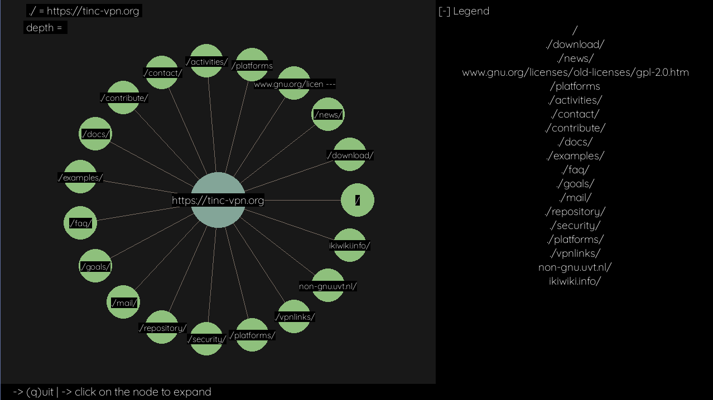

<p align="center">

</p>

# Introduction

Qaahl a simple webcrawler that can generate a graphical view of the crawled path. <br>
More of a visualization of how various hyperlinks connect. A module to scrap the pages<br>crawled. Depth limited crawling. Multithreading to be implemented.

<p align="center">

</p>

### Libraries utilised
- Pygame
- Requests
- Beautiful Soup (Bs4)

# Run

```console
pip install -r requirements.txt
python3 main.py $URL $flags
```

Replace 
- `$URL` with the link as the base url
- `$flags` with flags e.g. -d 3 performs depth=3 traversal
